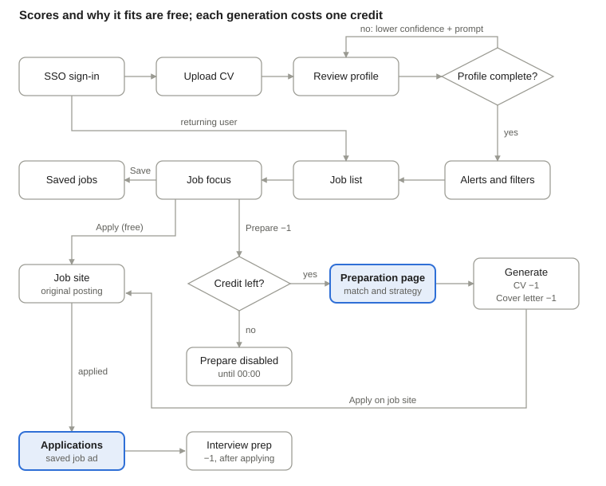
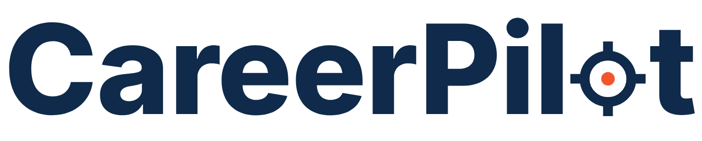

# 04 · Design

Wireframe plan: [Confluence](https://glogoveanu.atlassian.net/wiki/spaces/PRD/pages/5177354) · Prototype: [Figma](https://www.figma.com/design/4SXo5dQmlYyQCiOW4ZJwCt/CareerPilot-test)

## Screens

1. SSO sign-in (Figma Community SSO card)
2. Onboarding: upload CV, review profile, done (no completeness gate: scores always show, with a confidence label and prompts for missing fields)
3. Job alerts and filters
4. Job list: match badge, "Why it fits", Save
5. Job focus: Prepare application (−1, primary), Apply on job site (free), Save (free); plus one 390 × 844 mobile frame
6. Application preparation: detailed match, strategy, CV and cover letter (−1 each)
7. Application history: saved job description, status, Prepare for interview (−1)

Credits pill in the header ("7 of 10 credits left today"); clicking it opens the pay-as-you-apply dialog marked "Coming soon".

## Brand (logo A, reticle wordmark)

| Role | Colour |
| --- | --- |
| Primary (60%) | Navy `#0F2A4A` |
| Secondary (30%) | Mist `#E8EEF6` |
| Accent (10%) | Flare `#F2542D`, graphics only, never small text |
| Muted text / lines | `#5B6B80` / `#D5DEEA` |

Typeface: Inter (ExtraBold for the wordmark). The orange centre dot is the only accent and stands for "your target role"; it doubles as the credit icon. Options and rationale: `brand/careerpilot-logo-options.html`.
